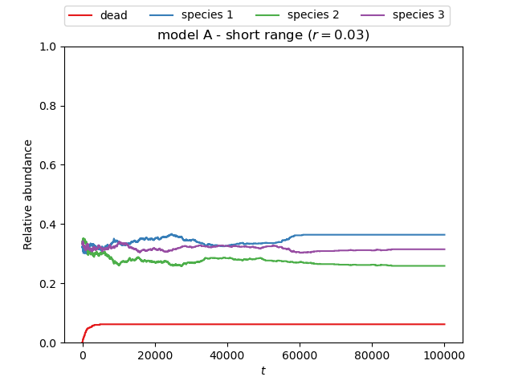
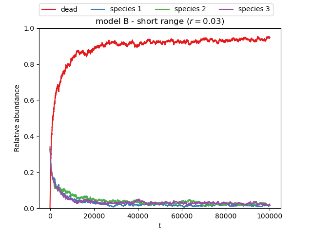
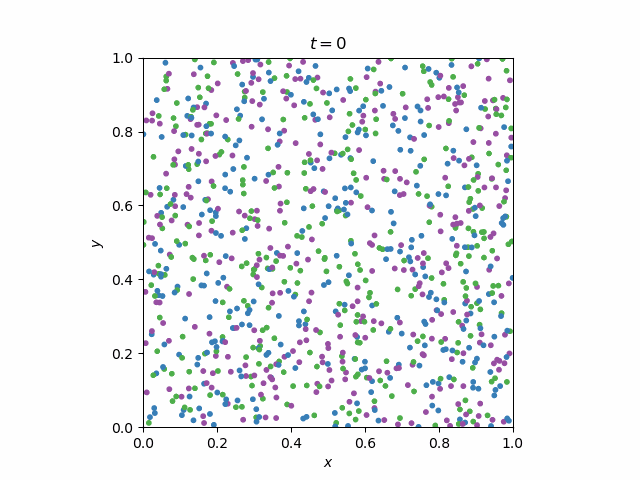
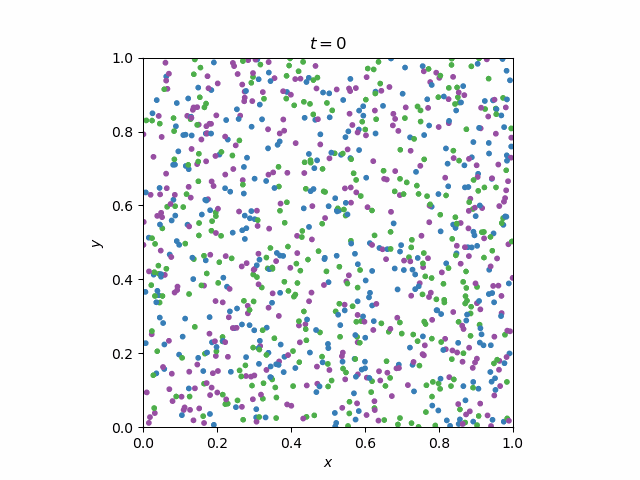
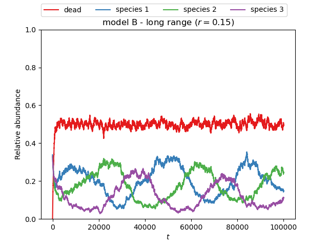
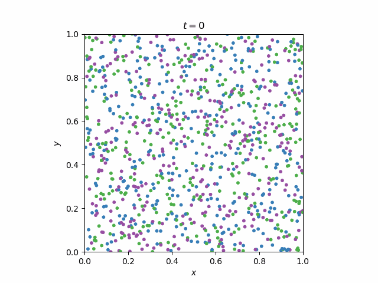
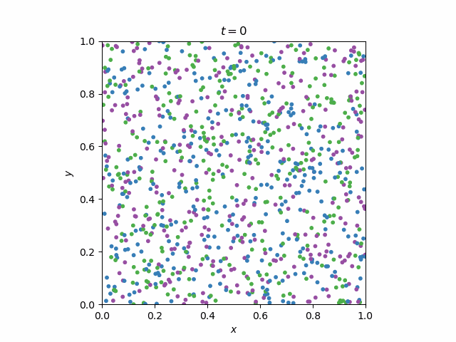

# Ecosystem simulation

Simulation of competitive ecological communities of sessile individuals based on [[1]](#1).

## Set up

```
$ conda env create -f environment.yml
```

## Example

```
$ python example.py
```
### Short range

<p align="center">


</p>
<p align="center">


</p>

### Long range

<p align="center">


</p>
</p>
<p align="center">


</p>
</p>

## References

<a id="1">[1]</a> Calleja-Solanas, V., Khalil, N., Gómez-Gardeñes, J., Hernández-García, E., & Meloni, S. (2022). Structured interactions as a stabilizing mechanism for competitive ecological communities. Physical Review E, 106(6), 064307; ArXiv:2012.14916.